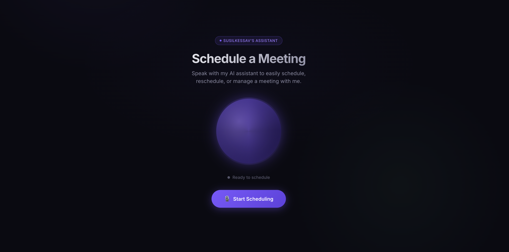

# Voice Scheduling Agent

A real-time voice assistant that schedules meetings by collecting your name, preferred date & time, and an optional meeting title — then creates a real Google Calendar event.
**Tech Stack:** [Vapi](https://vapi.ai) · Next.js · Google Calendar · Vercel



### Demo Screen Recording
https://drive.google.com/file/d/1QeG3a26TDME5Wf7u1FDg6e6aZkx5S7K8/view?usp=sharing)

Live Demo:
```bash
https://voice-scheduling-agent-five.vercel.app/
```
---
### How to test it

1. Open the link above in your browser
2. Click **Start Scheduling**
3. Allow microphone access when prompted
4. Speak naturally — for example:

   > "I'd like to schedule a meeting tomorrow at 3pm"

5. The assistant will ask for your name and confirm the details
6. Once confirmed, a real Google Calendar event will be created

> No account or login is required to test the voice flow. Calendar events are created on the demo Google Calendar connected to this deployment.

---
## How the Calendar Integration Works

This project uses Vapi's built-in Google Calendar integration rather than a custom API implementation.

1. In the Vapi dashboard, navigate to **Integrations → Tools Provider → Google Calendar** and connect a Google account. This authorizes Vapi to create events on behalf of that account using OAuth.
2. The assistant is configured with the `google.calendar.event.create` tool inside `lib/vapi-config.ts`. This tells Vapi which tool to call and what parameters to pass once the user has confirmed their details.
3. During the call, once the user confirms their name, date, time, and optional meeting title, Vapi calls the tool in real time and the event is created immediately.
4. The webhook at `/api/vapi/webhook` receives the call status and tool call results, which can be used for logging or any follow-up actions.

### Example Logs: Successful Event Creation

When the user confirms the meeting details, Vapi automatically triggers the Google Calendar integration. Here is a real payload showing the AI passing the exact arguments to the function, and Google Calendar returning the confirmed event link:

```json
// Vapi calls the predefined Calendar tool
{
  "role": "tool_calls",
  "toolCalls": [
    {
      "type": "function",
      "function": {
        "name": "google_calendar_tool",
        "arguments": "{\n  \"summary\": \"Catch-up Call with Sam\",\n  \"timeZone\": \"America/New_York\",\n  \"startDateTime\": \"2026-02-26T14:00:00\",\n  \"endDateTime\": \"2026-02-26T14:30:00\",\n  \"attendees\": [\"susilkessavsb@gmail.com\"]\n}"
      }
    }
  ]
}

// Google Calendar authenticates and returns the successful event link
{
  "name": "google_calendar_tool",
  "role": "tool_call_result",
  "result": "{\n  \"status\": \"confirmed\",\n  \"htmlLink\": \"https://www.google.com/calendar/event?eid=...\",\n  \"summary\": \"Catch-up Call with Sam\",\n  \"start\": {\n    \"dateTime\": \"2026-02-26T14:00:00-05:00\",\n    \"timeZone\": \"America/New_York\"\n  },\n  \"attendees\": [\n    {\n      \"email\": \"susilkessavsb@gmail.com\",\n      \"responseStatus\": \"needsAction\"\n    }\n  ]\n}"
}
```

No direct Google API calls are made from the app itself — Vapi handles the OAuth token, the API request, and error handling end to end.

---
## Features

- Natural voice conversation to schedule meetings
- Real Google Calendar event creation
- GPT-4o powered with context awareness
- Live transcript display during calls
- Animated voice orb with volume-reactive UI
- One-click Vercel deployment

---

## Quick Start

### 1. Install dependencies

```bash
npm install
```

### 2. Configure environment variables

```bash
cp .env.example .env.local
```

Edit `.env.local` with your keys:

```env
NEXT_PUBLIC_VAPI_PUBLIC_KEY=your_vapi_public_key_here
VAPI_PRIVATE_KEY=your_vapi_private_key_here
```

### 3. Set up Vapi and Google Calendar

1. Create an account at [dashboard.vapi.ai](https://dashboard.vapi.ai)
2. Go to **Organization Settings** and copy your **Public Key** and **Private Key**
3. Go to **Integrations → Tools Provider → Google Calendar**, click **Connect**, and authorize
4. Optionally, create an assistant in the dashboard and add Google Calendar tools

> The app can either use a pre-configured assistant ID (`NEXT_PUBLIC_VAPI_ASSISTANT_ID`) or create the assistant inline using the config in `lib/vapi-config.ts`.

### 4. Run locally

```bash
npm run dev
```

Open [http://localhost:3000](http://localhost:3000) and click **Start Scheduling**.

---

## Deploy to Vercel

**Option A — CLI:**

```bash
npx vercel
```

**Option B — GitHub:**

1. Push this repo to GitHub
2. Import it at [vercel.com/new](https://vercel.com/new)
3. Add your environment variables in the Vercel dashboard
4. Deploy

After deploying, set your **Server URL** in the Vapi Dashboard:

```
https://your-app.vercel.app/api/vapi/webhook
```

---

## Project Structure

```
├── app/
│   ├── api/vapi/webhook/
│   │   └── route.ts          # Vapi webhook handler
│   ├── globals.css            # Global styles & animations
│   ├── layout.tsx             # Root layout
│   └── page.tsx               # Main voice UI page
├── lib/
│   └── vapi-config.ts         # Vapi assistant configuration
├── .env.example               # Environment variable template
└── README.md
```

---

## How It Works

1. User clicks **Start Scheduling** — the `@vapi-ai/web` SDK opens a WebSocket to Vapi
2. Vapi orchestrates the conversation using GPT-4o with the system prompt in `lib/vapi-config.ts`
3. The user speaks naturally — name, date/time, and optional title are collected conversationally
4. The assistant confirms the details and calls the `google.calendar.event.create` tool
5. Vapi's built-in Google Calendar integration creates the event
6. The webhook at `/api/vapi/webhook` receives status updates and call reports

---

## License

MIT
